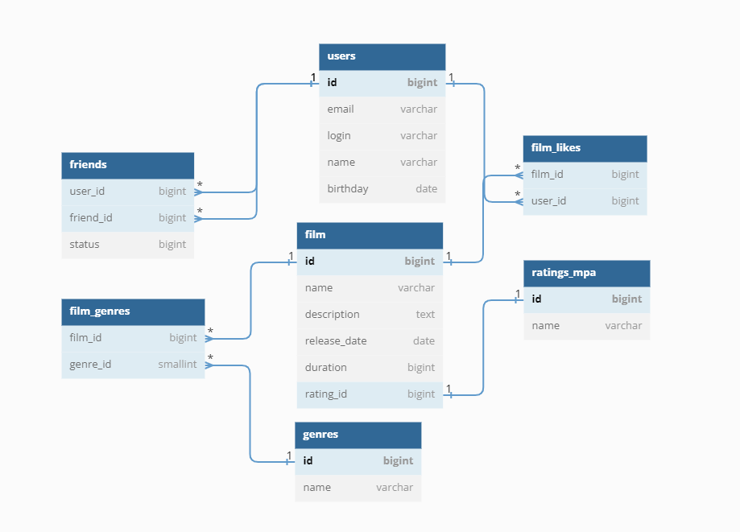

# Filmorate

## Модель базы данных представлена на ER-диаграмме

---


### Примеры запросов в базу данных

---

<details>
  <summary>Получение всех пользователей</summary>

```sql
    SELECT *
    FROM users;
```
</details>

<details>
  <summary>Получение всех фильмов</summary>

```sql
    SELECT *
    FROM films;
```
</details>  

<details>
  <summary>Вывод лайков у фильма с id = 1</summary>

```sql
    SELECT f.name AS film_name,
	       u.name AS user_name
    FROM films AS f
    INNER JOIN film_likes AS fl ON f.id = fl.film_id
    INNER JOIN users AS u ON fl.user_id = u.id
    WHERE f.id = 1;
```
</details>  

<details>
  <summary>Вывод фильмов с рейтингом PG-13</summary>

```sql
    SELECT f.name AS film_name,
	       rm.name AS rating
    FROM films AS f
    INNER JOIN ratings_mpa AS rm ON f.rating_id = rm.id
    WHERE rm.name = 'PG-13';
```
</details> 

<details>
  <summary>Вывод топ-10 фильмов по лайкам</summary>

```sql
    SELECT f.name AS film_name,
	       COUNT(fl.film_id) AS count_likes
    FROM films AS f
    LEFT OUTER JOIN film_likes AS fl ON f.id = fl.film_id
    GROUP BY film_name
    ORDER BY count_likes DESC
    LIMIT 10;
```
</details>

<details>
  <summary>Вывод фильмов в жанре "Боевик"</summary>

```sql
    SELECT f.name AS film_name
    FROM films AS f
    INNER JOIN film_genres AS fg ON f.id = fg.film_id
    INNER JOIN genres AS g ON fg.genre_id = g.id
    WHERE g.name = 'Боевик';
```
</details>

<details>
  <summary>Вывод топ-10 фильмов по лайкам в жанре "Боевик"</summary>

```sql
    SELECT f.name AS film_name,
	       COUNT(fl.film_id) AS count_likes
    FROM films AS f
    INNER JOIN film_genres AS fg ON f.id = fg.film_id
    INNER JOIN genres AS g ON fg.genre_id = g.id
    LEFT OUTER JOIN film_likes AS fl ON f.id = fl.film_id
    WHERE g.name = 'Боевик'
    GROUP BY film_name
    ORDER BY count_likes DESC
    LIMIT 10;
```
</details>
